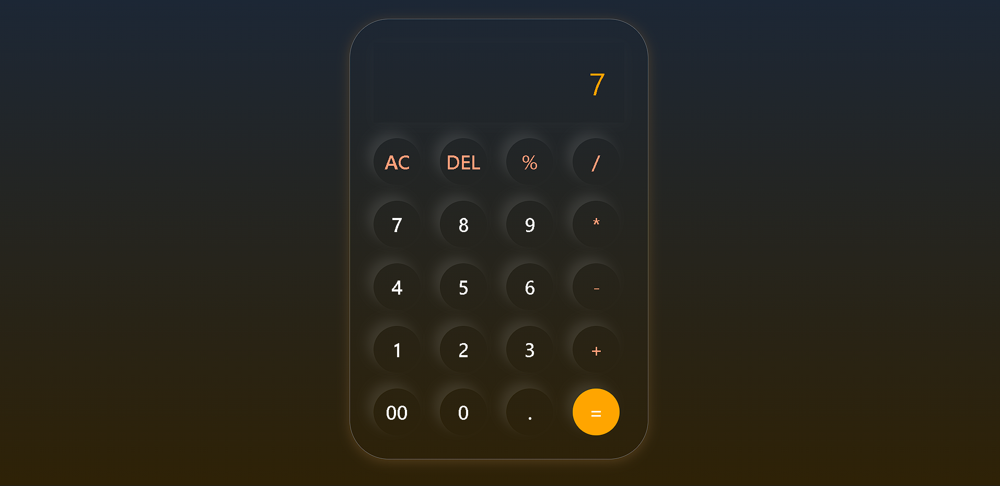
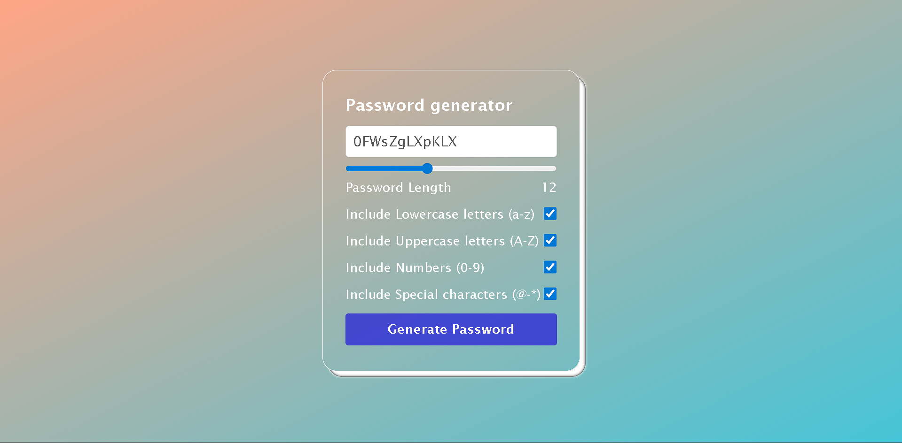

# Basic JS Projects

This repository contains two beginner-friendly JavaScript projects:

## 1. Calculator

A simple calculator web app built with HTML, CSS, and JavaScript. It supports basic arithmetic operations and provides a clean, responsive UI.

- **Folder:** `calculator/`
- **Files:**
	- `index.html`: Main HTML file
	- `style.css`: Stylesheet
	- `app.js`: JavaScript logic

## 2. Password Generator

A password generator web app that creates secure, random passwords based on user-selected criteria. Built with HTML, CSS, and JavaScript.

- **Folder:** `Password-generator/`
- **Files:**
	- `index.html`: Main HTML file
	- `style.css`: Stylesheet
	- `app.js`: JavaScript logic

---

